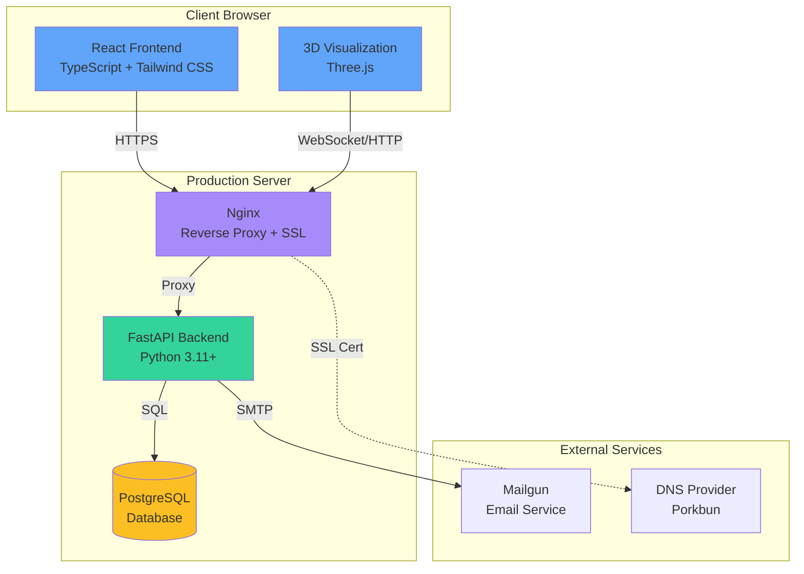

# BendBionics - Soft Robot Simulation Platform

<div align="center">


[](https://bendbionics.com)
[](./README.md)

A modern, full-stack web application for simulating soft robot kinematics using the Piecewise Constant Curvature (PCC) model. Built with cutting-edge technologies and deployed at **[bendbionics.com](https://bendbionics.com)**.

[🚀 Live Demo](https://bendbionics.com) • [📖 Documentation](./README.md) • [🤝 Contributing](./CONTRIBUTING.md) • [📄 License](./LICENSE)

</div>

---

## 🚀 Live Demo

**Experience the application live:** [https://bendbionics.com](https://bendbionics.com)

## Overview

BendBionics is a production-ready, full-stack web application for simulating soft robot kinematics using the Piecewise Constant Curvature (PCC) model. This project demonstrates expertise in modern web development, 3D graphics programming, mathematical modeling, and production deployment.

### Key Highlights

- **Live Production Deployment**: Fully deployed at [bendbionics.com](https://bendbionics.com) with SSL, CI/CD, and automated testing
- **Advanced Mathematics**: Implementation of complex robotics kinematics (PCC model) with real-time parameter adjustment
- **Modern Full-Stack**: React 19 + TypeScript frontend, FastAPI + PostgreSQL backend
- **3D Visualization**: Interactive Three.js-based 3D rendering with live updates
- **Production Engineering**: Complete DevOps pipeline with GitHub Actions, automated testing, and secure deployment

### Technical Achievements

This project showcases:

- **Full-Stack Development**: End-to-end implementation from frontend UI to backend API and database
- **Advanced 3D Graphics**: Real-time Three.js visualization with interactive controls and parameter updates
- **Mathematical Modeling**: Implementation of Piecewise Constant Curvature kinematics for accurate soft robot simulation
- **Modern Tooling**: Cutting-edge package managers (Bun, uv) for 10-30x faster build times
- **Production DevOps**: Complete CI/CD pipeline, automated testing, secure deployment with nginx and SSL
- **Performance Optimization**: Web-optimized builds, efficient rendering, and minimal re-renders

## Architecture



### System Components

- **Frontend**: React 19 with TypeScript, Tailwind CSS 4, Three.js for 3D rendering
- **Backend**: FastAPI with async/await, SQLModel for database ORM
- **Database**: PostgreSQL for production, SQLite for development
- **Deployment**: Ubuntu server with nginx, systemd, Let's Encrypt SSL
- **CI/CD**: GitHub Actions for automated testing and deployment
- **Package Managers**: Bun (frontend) and uv (backend) for fast dependency management

## Features

### 🎨 User Interface

- **Modern Design**: macOS Tahoe 26 aesthetic with liquid glass styling
- **Responsive Layout**: Optimized for desktop and tablet devices
- **Real-time Updates**: Instant visual feedback as parameters change
- **Intuitive Controls**: Clean, accessible form controls with validation

### 🤖 Robot Simulation

- **3D Visualization**: Interactive Three.js-based 3D rendering of robot segments
- **PCC Model**: Accurate Piecewise Constant Curvature kinematics implementation
- **Flexible Configuration**: Support for 3-12 tendon configurations
- **Parameter Adjustment**: Real-time modification of segment length, curvature, rotation
- **Unit Conversion**: Automatic conversion between degrees/radians, mm/cm/m

### 👤 User Management

- **Authentication**: Secure JWT-based authentication system
- **User Profiles**: Profile management with email verification
- **Preset Management**: Save, load, and share robot configurations
- **Public Presets**: Discover and use community-shared configurations

### ⚡ Performance

- **Optimized Rendering**: Efficient 3D scene updates with minimal re-renders
- **Fast Build Times**: Bun package manager (10-30x faster than npm)
- **Modern Tooling**: uv for Python dependencies (faster than pip)
- **Web Optimized**: Production builds optimized for modern browsers

## Technology Stack

### Frontend

- **React 19**: Latest React with concurrent features
- **TypeScript**: Type-safe development
- **Tailwind CSS 4**: Utility-first styling with custom design system
- **Three.js**: 3D graphics and visualization
- **React Router**: Client-side routing
- **Vite**: Fast build tool and dev server
- **Bun**: Ultra-fast JavaScript runtime and package manager

### Backend

- **FastAPI**: Modern, fast Python web framework
- **SQLModel**: SQL database in Python, designed for simplicity
- **PostgreSQL**: Production database
- **Pydantic**: Data validation using Python type annotations
- **JWT**: Secure token-based authentication
- **uv**: Fast Python package manager

### DevOps & Deployment

- **GitHub Actions**: CI/CD automation
- **nginx**: Reverse proxy and static file serving
- **systemd**: Service management
- **Let's Encrypt**: Free SSL certificates
- **Docker-ready**: Containerization support

### Testing

- **Vitest**: Fast unit testing for frontend
- **Playwright**: End-to-end browser testing
- **pytest**: Backend testing framework
- **Storybook**: Component documentation and visual testing

## Quick Start

### Prerequisites

- **Bun** (JavaScript runtime & package manager) - [Installation Guide](https://bun.sh/docs/installation)

  ```bash
  curl -fsSL https://bun.sh/install | bash
  ```

- **Python** 3.11 or higher
- **uv** (Python package manager) - [Installation Guide](https://github.com/astral-sh/uv)

  ```bash
  curl -LsSf https://astral.sh/uv/install.sh | sh
  ```

- **PostgreSQL** (for production) or SQLite (for development)

### First-Time Setup

```bash
# Clone the repository
git clone https://github.com/max-barthel/bendbionics.git
cd bendbionics

# Set up development environment
# Note: If setup.sh doesn't exist, follow manual setup below
./setup.sh
```

**Manual Setup** (if setup script is unavailable):

```bash
# Backend setup
cd backend
uv sync
cp .env.example .env  # Edit .env with your configuration

# Frontend setup
cd ../frontend
bun install
```

### Development

```bash
# Start development environment (runs both frontend and backend)
./dev.sh

# Or start services manually:
# Backend: cd backend && uv run uvicorn app.main:app --reload --host 0.0.0.0 --port 8000
# Frontend: cd frontend && bun run dev
```

The application will be available at:

- **Frontend**: <http://localhost:5173>
- **Backend API**: <http://localhost:8000>
- **API Documentation**: <http://localhost:8000/docs>

### Testing

```bash
# Run all tests
./toolkit.sh all test

# Frontend tests only
cd frontend && bun run test

# Backend tests only
cd backend && uv run pytest

# Integration tests
cd frontend && bun run test:integration
```

### Building

```bash
# Build for production
./build.sh
```

## Deployment

BendBionics is designed for deployment on Ubuntu servers with nginx and SSL.

### Production Deployment

```bash
# Complete deployment workflow (build, upload, deploy)
./deploy.sh
```

The deployment workflow handles:

- Building optimized production bundles
- Uploading to server via SSH
- Database migrations
- Service restart
- Health checks
- Cleanup of deployment packages

For detailed deployment documentation, see the deployment scripts in the `scripts/deploy/` directory.

## Project Structure

```txt
bendbionics/
├── frontend/              # React web application
│   ├── src/
│   │   ├── components/    # React components
│   │   ├── features/      # Feature modules
│   │   ├── api/           # API client
│   │   └── utils/         # Utility functions
│   ├── dist/              # Production build output
│   └── package.json       # Frontend dependencies
├── backend/                # FastAPI backend
│   ├── app/
│   │   ├── api/           # API routes
│   │   ├── models/        # Data models (PCC, tendons, users)
│   │   ├── services/      # Business logic
│   │   └── utils/         # Utilities
│   ├── tests/             # Backend tests
│   └── pyproject.toml     # Python dependencies
├── config/                 # Deployment configurations
│   ├── nginx/             # Nginx configuration
│   └── systemd/           # Service configuration
├── scripts/                # Development and deployment scripts
├── .github/                # GitHub Actions workflows
├── README.md              # This file
├── LICENSE                # MIT License
└── CONTRIBUTING.md        # Contribution guidelines
```

## Development Workflow

- **Development**: `./dev.sh` - Start both frontend and backend in development mode
- **Building**: `./build.sh` - Create production builds
- **Deployment**: `./deploy.sh` - Deploy to production server
- **Testing**: `./toolkit.sh all test` - Run all test suites
- **Code Quality**: Pre-commit hooks enforce formatting and linting

For detailed script documentation, see [SCRIPTS.md](./SCRIPTS.md).

## Code Quality Standards

- **Essential Testing**: Test what actually breaks, not everything
- **TypeScript When Helpful**: Use types to prevent bugs, not for perfection
- **Basic Linting**: Catch obvious errors, not style perfection
- **Simple Commits**: Clear messages, no complex conventions
- **User-Focused Docs**: Document what users need, not everything

## Contributing

We welcome contributions! Please see [CONTRIBUTING.md](./CONTRIBUTING.md) for guidelines on:

- Code style and standards
- Testing requirements
- Pull request process
- Development setup

## Documentation

- **[SCRIPTS.md](./SCRIPTS.md)**: Complete documentation of all development scripts
- **[RULES.md](./RULES.md)**: Project rules and conventions

## License

This project is licensed under the MIT License - see the [LICENSE](./LICENSE) file for details.

## Screenshots

Visit the [live demo](https://bendbionics.com) to see the application in action with real-time 3D visualization and interactive controls.

## Acknowledgments

- Built with modern web technologies and best practices
- Inspired by soft robotics research and applications
- Designed for both research and educational use
- Special thanks to the open-source community for excellent tools and libraries

---

<div align="center">

**Live Application**: [https://bendbionics.com](https://bendbionics.com)

Made with ❤️ for the robotics and engineering community

</div>
