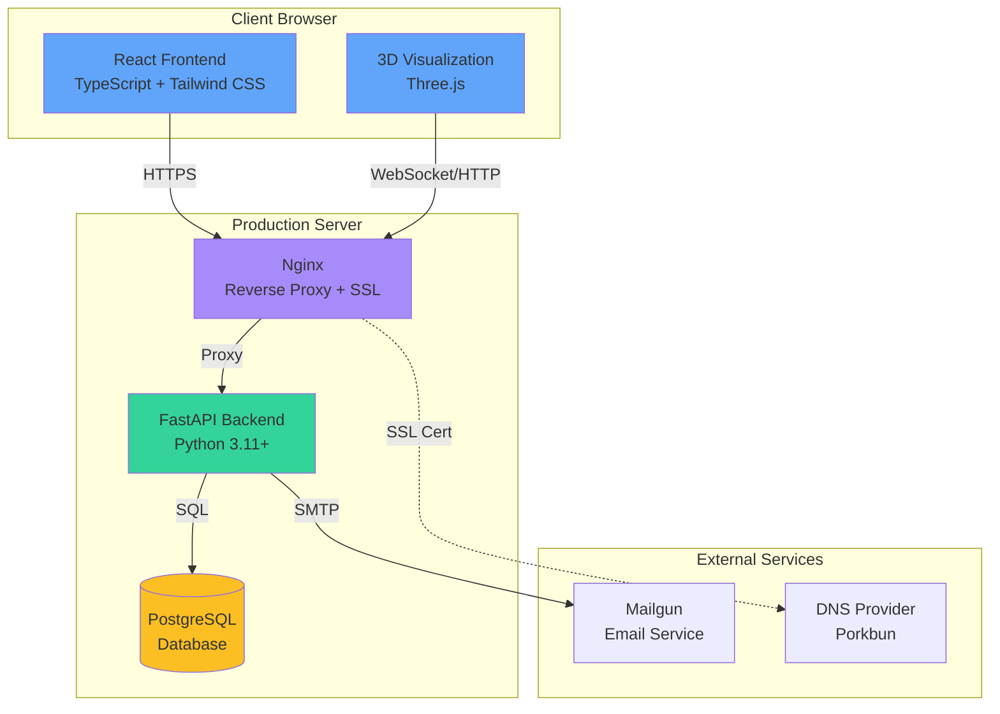

# BendBionics - Soft Robot Simulation Platform

A modern, full-stack web application for simulating soft robot kinematics using the Piecewise Constant Curvature (PCC) model.

**Live Demo**: [bendbionics.com](https://bendbionics.com)

## Overview

BendBionics is a production-ready web application for simulating soft robot kinematics using the Piecewise Constant Curvature (PCC) model. Features include:

- **3D Visualization**: Interactive Three.js-based rendering with real-time parameter adjustment
- **PCC Model**: Accurate kinematics implementation for soft robot simulation
- **User Management**: JWT authentication, preset management, and sharing
- **Modern Stack**: React 19 + TypeScript, FastAPI + PostgreSQL
- **Production Ready**: Deployed at [bendbionics.com](https://bendbionics.com) with CI/CD and automated testing

## Architecture



### System Components

- **Frontend**: React 19 with TypeScript, Tailwind CSS 4, Three.js for 3D rendering
- **Backend**: FastAPI with async/await, SQLModel for database ORM
- **Database**: PostgreSQL for production, SQLite for development
- **Deployment**: Ubuntu server with nginx, systemd, Let's Encrypt SSL
- **CI/CD**: GitHub Actions with consolidated workflows for automated testing and deployment
- **Package Managers**: Bun (frontend) and uv (backend) for fast dependency management

## Features

- **3D Robot Visualization**: Interactive Three.js rendering with real-time parameter updates
- **PCC Kinematics**: Accurate Piecewise Constant Curvature model implementation
- **Flexible Configuration**: Support for 3-12 tendon configurations
- **User Authentication**: JWT-based auth with preset management and sharing
- **Unit Conversion**: Automatic conversion between degrees/radians, mm/cm/m
- **Modern UI**: macOS Tahoe aesthetic with responsive design

## Technology Stack

**Frontend**: React 19, TypeScript, Tailwind CSS 4, Three.js, Vite, Bun
**Backend**: FastAPI, SQLModel, PostgreSQL, Pydantic, JWT, uv
**DevOps**: GitHub Actions, nginx, Docker, Let's Encrypt
**Testing**: Vitest, Playwright, pytest, Storybook

## Quick Start

### Prerequisites

- **Bun** (JavaScript runtime & package manager) - [Installation Guide](https://bun.sh/docs/installation)

  ```bash
  curl -fsSL https://bun.sh/install | bash
  ```

- **Python** 3.11 or higher
- **uv** (Python package manager) - [Installation Guide](https://github.com/astral-sh/uv)

  ```bash
  curl -LsSf https://astral.sh/uv/install.sh | sh
  ```

- **PostgreSQL** (for production) or SQLite (for development)

### First-Time Setup

```bash
# Clone the repository
git clone https://github.com/max-barthel/bendbionics.git
cd bendbionics

# Set up development environment
./scripts/setup.sh
```


### Development

```bash
# Start development environment (runs both frontend and backend)
./dev.sh
```

The application will be available at:

- **Frontend**: <http://localhost:5173>
- **Backend API**: <http://localhost:8000>
- **API Documentation**: <http://localhost:8000/docs>

### Testing

```bash
# Run all tests
./toolkit.sh test all

# Frontend tests only
./toolkit.sh test frontend

# Backend tests only
./toolkit.sh test backend

# Integration tests
cd frontend && bun run test:integration
```

### Building

```bash
# Build for production
./build.sh

# Build and test locally
./build.sh --test
```

## Deployment

BendBionics uses Docker for deployment to Hetzner VPS or any Ubuntu server.

### Docker Deployment (Recommended)

The application is containerized and deployed using Docker Compose:

```bash
# Build and push Docker images to registry
./scripts/docker/build-and-push.sh

# On VPS: Pull and deploy (no source code needed!)
./scripts/docker/deploy-vps.sh
```

**Deployment Workflow:**

1. Build and push images: `./scripts/docker/build-and-push.sh`
2. Deploy on VPS: `./scripts/docker/deploy-vps.sh`

Images are pulled from GitHub Container Registry (GHCR) - no source code needed on VPS.

## Project Structure

```txt
bendbionics/
├── frontend/              # React web application
│   ├── src/
│   │   ├── components/    # React components
│   │   ├── features/      # Feature modules
│   │   ├── api/           # API client
│   │   └── utils/         # Utility functions
│   ├── dist/              # Production build output
│   └── package.json       # Frontend dependencies
├── backend/                # FastAPI backend
│   ├── app/
│   │   ├── api/           # API routes
│   │   ├── models/        # Data models (PCC, tendons, users)
│   │   ├── services/      # Business logic
│   │   └── utils/         # Utilities
│   ├── tests/             # Backend tests
│   └── pyproject.toml     # Python dependencies
├── docker/                 # Docker configuration
│   ├── nginx/             # Nginx Docker configuration
│   └── env.example        # Environment template
├── scripts/                # Development and deployment scripts
│   └── docker/            # Docker deployment scripts
├── .github/                # GitHub Actions workflows
├── README.md              # This file
├── LICENSE                # MIT License
└── CONTRIBUTING.md        # Contribution guidelines
```

## Development Workflow

### Essential Scripts

- **`./scripts/setup.sh`** - First-time setup (installs dependencies, configures environment)
- **`./dev.sh`** - Start development environment (frontend + backend)
- **`./build.sh`** - Build for production (use `--test` flag to test build locally)
- **`./toolkit.sh`** - Development tools (testing, linting, quality checks, health checks)
- **`./scripts/cleanup.sh`** - Clean build artifacts and temporary files

### Common Toolkit Commands

```bash
./toolkit.sh test all      # Run all tests
./toolkit.sh lint all      # Run linting
./toolkit.sh fix all       # Auto-fix issues
./toolkit.sh health        # Check system health
./toolkit.sh docs storybook # Start Storybook
./toolkit.sh quick         # Quick error checks
```

For more toolkit commands, run `./toolkit.sh` to see all options.

## Code Quality Standards

- **Essential Testing**: Test what actually breaks, not everything
- **TypeScript When Helpful**: Use types to prevent bugs, not for perfection
- **Basic Linting**: Catch obvious errors, not style perfection
- **Simple Commits**: Clear messages, no complex conventions
- **User-Focused Docs**: Document what users need, not everything

## Contributing

We welcome contributions! Please see [CONTRIBUTING.md](./CONTRIBUTING.md) for guidelines on:

- Code style and standards
- Testing requirements
- Pull request process
- Development setup

## Documentation

- **[CONTRIBUTING.md](./CONTRIBUTING.md)**: Contribution guidelines and development setup

## License

This project is licensed under the MIT License - see the [LICENSE](./LICENSE) file for details.
