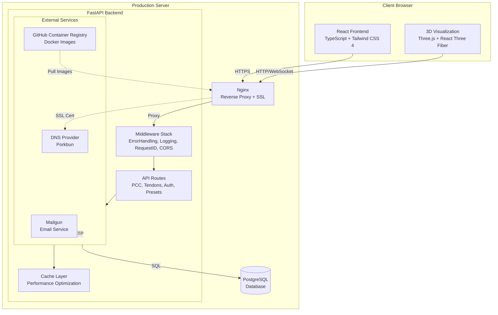

# BendBionics - Soft Robot Simulation Platform

A modern, full-stack web application for simulating soft robot kinematics using the Piecewise Constant Curvature (PCC) model.

**Live Demo**: [bendbionics.com](https://bendbionics.com)

## Overview

BendBionics is a production-ready web application for simulating soft robot kinematics using the Piecewise Constant Curvature (PCC) model. Features include:

- **3D Visualization**: Interactive Three.js-based rendering with real-time parameter adjustment
- **PCC Model**: Accurate kinematics implementation for soft robot simulation
- **User Management**: JWT authentication, preset management, and sharing
- **Modern Stack**: React 19 + TypeScript, FastAPI + PostgreSQL
- **Production Ready**: Deployed at [bendbionics.com](https://bendbionics.com) with CI/CD and automated testing

## Architecture


```mermaid
graph TB
    subgraph Client["Client Browser"]
        UI[React Frontend<br/>TypeScript + Tailwind CSS 4]
        Viz[3D Visualization<br/>Three.js + React Three Fiber]
    end

    subgraph Server["Production Server"]
        Nginx[Nginx<br/>Reverse Proxy + SSL]
        subgraph APIStack["FastAPI Backend"]
            Middleware[Middleware Stack<br/>ErrorHandling, Logging, RequestID, CORS]
            Routes[API Routes<br/>PCC, Tendons, Auth, Presets]
            Services[Business Logic<br/>PCC Model, Tendon Engine, User Service]
            Cache[Cache Layer<br/>Performance Optimization]
        end
        DB[(PostgreSQL<br/>Database)]
    end

    subgraph Services["External Services"]
        Mailgun[Mailgun<br/>Email Service]
        DNS[DNS Provider<br/>Porkbun]
        GHCR[GitHub Container Registry<br/>Docker Images]
    end

    UI -->|HTTPS| Nginx
    Viz -->|HTTP/WebSocket| Nginx
    Nginx -->|Proxy| Middleware
    Middleware --> Routes
    Routes --> Services
    Services --> Cache
    Services -->|SQL| DB
    Services -->|SMTP| Mailgun
    Nginx -.->|SSL Cert| DNS
    GHCR -.->|Pull Images| Nginx
```

### System Components

- **Frontend**: React 19 with TypeScript, Tailwind CSS 4, Three.js with React Three Fiber and Drei for 3D rendering
- **Backend**: FastAPI with async/await, SQLModel for database ORM, comprehensive middleware stack
- **Middleware**: ErrorHandlingMiddleware, LoggingMiddleware, RequestIDMiddleware, and CORS middleware for unified request/response handling
- **Database**: PostgreSQL for production, SQLite for development with SQLModel ORM
- **Deployment**: Docker-based deployment with a host-level nginx reverse proxy and SSL (Let's Encrypt on the host), plus GitHub Container Registry
- **Package Managers**: Bun (frontend, 10-30x faster than npm) and uv (backend, modern Python package manager)
- **API Response Format**: Unified response system with consistent `success`, `data`, `message`, `timestamp`, and `request_id` fields

## Features

- **3D Robot Visualization**: Interactive Three.js rendering with React Three Fiber and Drei, real-time parameter updates, and live preview
- **PCC Kinematics**: Accurate Piecewise Constant Curvature model implementation with comprehensive transformation calculations
- **Advanced Tendon System**: Flexible configuration supporting 3-12 tendons with sophisticated routing calculations and actuation analysis
- **User Authentication**: JWT-based authentication with secure password hashing, email verification, and password reset functionality
- **Preset Management**: Save, load, and share robot configurations with public/private preset sharing capabilities
- **Unit Conversion**: Automatic conversion between degrees/radians, mm/cm/m for seamless parameter input
- **Performance Optimization**: Intelligent caching system for frequently computed results
- **Comprehensive Error Handling**: Unified error response system with detailed logging and request tracking
- **Modern UI**: macOS Tahoe aesthetic with liquid glass styling and responsive design
- **Real-time Updates**: Live parameter adjustment with instant 3D visualization feedback

## Technology Stack

**Frontend**: React 19, TypeScript, Tailwind CSS 4, Three.js, @react-three/fiber, @react-three/drei, Vite, Bun, Vitest, Playwright, Storybook
**Backend**: FastAPI, SQLModel, PostgreSQL, Pydantic, JWT (python-jose), uv, pytest, ruff
**DevOps**: Docker, Docker Compose, host nginx, certbot (host), GitHub Container Registry (GHCR)
**Services**: Mailgun (email), Porkbun (DNS)
**Testing**: Vitest (frontend unit tests), Playwright (E2E tests), pytest (backend tests), Storybook (component documentation)

## Quick Start

### Prerequisites

- **Bun** (JavaScript runtime & package manager) - [Installation Guide](https://bun.sh/docs/installation)

  ```bash
  curl -fsSL https://bun.sh/install | bash
  ```

- **Python** 3.11 or higher
- **uv** (Python package manager) - [Installation Guide](https://github.com/astral-sh/uv)

  ```bash
  curl -LsSf https://astral.sh/uv/install.sh | sh
  ```

- **PostgreSQL** (for production) or SQLite (for development)

### First-Time Setup

```bash
# Clone the repository
git clone https://github.com/max-barthel/bendbionics.git
cd bendbionics

# Set up development environment
./scripts/setup.sh
```

### Development

```bash
# Start development environment (runs both frontend and backend)
./dev.sh
```

The application will be available at:

- **Frontend**: <http://localhost:5173>
- **Backend API**: <http://localhost:8000>
- **API Documentation**: <http://localhost:8000/docs>

### Testing

BendBionics uses a comprehensive testing strategy focused on essential paths and user value.

**Run All Tests:**

```bash
# Run all tests (frontend + backend)
./toolkit.sh test all

# Or run individually
./toolkit.sh test frontend  # Frontend unit tests (Vitest)
./toolkit.sh test backend   # Backend tests (pytest)
```

**Frontend Testing:**

```bash
cd frontend

# Unit tests with Vitest
bun run test                 # Watch mode
bun run test:run             # Run once
bun run test:coverage        # With coverage report
bun run test:ui              # Vitest UI

# End-to-end tests with Playwright
bun run test:integration     # Run E2E tests
bun run test:integration:ui  # Playwright UI mode
bun run test:integration:debug # Debug mode

# Visual regression tests
bun run test:visual
```

**Backend Testing:**

```bash
cd backend

# Run all tests
uv run pytest

# With coverage
uv run pytest --cov=app --cov-report=term-missing

# Specific test file
uv run pytest tests/test_pcc.py

# Verbose output
uv run pytest -v
```

**Test Coverage:**

- Frontend: Vitest with coverage reporting
- Backend: pytest with coverage (minimum 40% required)
- Integration: Playwright for critical user flows
- Component: Storybook for component documentation and visual testing

**Testing Philosophy:**

- Focus on what actually breaks, not exhaustive coverage
- Test critical paths and user-facing functionality
- Integration tests for API workflows
- E2E tests for important user journeys

### Building

```bash
# Build for production
./build.sh

# Build and test locally (starts test servers)
./build.sh --test
```

## API Endpoints

The API follows a unified response format with consistent error handling. All responses include `success`, `data`, `message`, `timestamp`, and `request_id` fields.

### PCC Kinematics

- `POST /api/kinematics` - Compute robot kinematics with tendon analysis
  - Accepts PCC parameters (segments, curvature, rotation, tendon configuration)
  - Returns 3D transformation matrices, positions, and visualization data

### Tendon System

- `POST /api/tendons/calculate` - Calculate tendon lengths and actuation requirements

  - Requires authentication
  - Returns tendon routing, lengths, and actuation commands

- `POST /api/tendons/analyze` - Analyze tendon configuration
  - Requires authentication
  - Returns comprehensive tendon analysis including coupling elements and routing visualization

### Authentication

- `POST /api/auth/register` - Register new user account

  - Sends email verification if enabled
  - Returns JWT access token

- `POST /api/auth/login` - Authenticate user

  - Returns JWT access token

- `GET /api/auth/me` - Get current user information

  - Requires authentication

- `PUT /api/auth/me` - Update user profile

  - Requires authentication

- `DELETE /api/auth/account` - Delete user account

  - Requires authentication

- `POST /api/auth/verify-email` - Verify email address

  - Uses verification token from email

- `POST /api/auth/reset-password` - Request password reset

  - Sends password reset email

- `POST /api/auth/reset-password/confirm` - Confirm password reset
  - Uses reset token from email

### Preset Management

- `POST /api/presets` - Create new preset

  - Requires authentication
  - Saves robot configuration for current user

- `GET /api/presets` - Get user's presets

  - Requires authentication
  - Returns list of user's private presets

- `GET /api/presets/public` - Get public presets

  - Returns list of publicly shared presets

- `GET /api/presets/{preset_id}` - Get specific preset

  - Requires authentication (for private presets)

- `PUT /api/presets/{preset_id}` - Update preset

  - Requires authentication
  - Must own the preset

- `DELETE /api/presets/{preset_id}` - Delete preset
  - Requires authentication
  - Must own the preset

### Health & Status

- `GET /api/health` - Health check endpoint
- `GET /api` - API root with version information
- `GET /docs` - Interactive API documentation (Swagger UI)
- `GET /redoc` - Alternative API documentation (ReDoc)

## Deployment

BendBionics uses Docker for deployment to Hetzner VPS or any Ubuntu server. The application is fully containerized with Docker Compose.

### Docker Architecture

The deployment uses three main containers:

- **backend**: FastAPI application with Gunicorn
- **frontend**: Static files served by its own container nginx
- **postgres**: PostgreSQL database

Reverse proxy and SSL termination are handled by **host-level nginx** (outside Docker). The host proxy should forward:

- `https://bendbionics.com/` -> `http://127.0.0.1:8081`
- `https://bendbionics.com/api/` -> `http://127.0.0.1:8001/`

### Docker Deployment Workflow

**1. Build and Push Images to Registry:**

```bash
# Build images and push to GitHub Container Registry
./scripts/docker/build-and-push.sh

# Or build without cache
NO_CACHE=true ./scripts/docker/build-and-push.sh
```

This script:

- Builds backend and frontend Docker images
- Tags images with version and `latest`
- Pushes to GitHub Container Registry (GHCR)
- Images are platform-specific (linux/amd64)

**2. Deploy on VPS:**

```bash
# On your VPS: Pull and deploy (no source code needed!)
./scripts/docker/deploy-vps.sh
```

This script:

- Pulls pre-built images from registry
- Sets up environment variables
- Initializes database if needed
- Starts all services with Docker Compose

After deployment, configure host-level nginx + certbot separately.
Any changes to container ports or routing must be validated against the host nginx config before deployment.

### Docker Scripts

Located in `scripts/docker/`:

- **`build-and-push.sh`** - Build and push images to registry
- **`deploy-vps.sh`** - Deploy on VPS (pulls from registry)
- **`setup.sh`** - Initial Docker setup on VPS
- **`backup.sh`** - Backup database and configuration
- **`deploy.sh`** - Alternative deployment script

### Docker Compose Configuration

The `docker-compose.yml` supports two modes:

- **Build mode** (default): Builds images from source
- **Registry mode**: Pulls pre-built images (set `USE_REGISTRY_IMAGES=true`)

### Environment Configuration

Copy `docker/env.example` to `.env` and configure:

- Database credentials
- Secret keys
- CORS origins
- Mailgun email service credentials
- Frontend/backend URLs
- SSL certificate domain settings

### SSL Certificates

SSL certificates are managed on the host (outside Docker):

- Use certbot with host nginx
- Configure automatic renewal via cron or systemd timer
- Reload host nginx after renewal

### Production Considerations

- Use strong passwords and secure secret keys
- Configure proper CORS origins
- Set up email service (Mailgun) for user verification
- Enable database backups
- Monitor logs and health endpoints
- Use production-grade PostgreSQL configuration

## Project Structure

```txt
bendbionics/
├── frontend/                    # React web application
│   ├── src/
│   │   ├── components/         # React components
│   │   │   ├── app/            # App-level components (modals, layout, sidebar)
│   │   │   ├── auth/           # Authentication components
│   │   │   ├── ui/             # Reusable UI components
│   │   │   └── icons/          # Icon components
│   │   ├── features/           # Feature modules
│   │   │   ├── auth/           # Authentication feature
│   │   │   ├── presets/        # Preset management feature
│   │   │   ├── robot-config/   # Robot configuration feature
│   │   │   ├── visualization/  # 3D visualization feature
│   │   │   └── shared/         # Shared feature utilities
│   │   ├── api/                # API client and authentication
│   │   ├── providers/          # React context providers (AppState, Auth)
│   │   ├── hooks/              # Custom React hooks
│   │   ├── types/              # TypeScript type definitions
│   │   ├── utils/              # Utility functions
│   │   ├── constants/          # Application constants
│   │   ├── styles/             # Design tokens and styling utilities
│   │   └── stories/            # Storybook stories
│   ├── e2e/                    # Playwright end-to-end tests
│   ├── dist/                   # Production build output
│   └── package.json           # Frontend dependencies (Bun)
├── backend/                     # FastAPI backend
│   ├── app/
│   │   ├── api/                # API route handlers
│   │   │   ├── routes.py       # PCC kinematics routes
│   │   │   ├── tendon_routes.py # Tendon calculation routes
│   │   │   ├── auth_routes.py  # Authentication routes
│   │   │   ├── preset_routes.py # Preset management routes
│   │   │   ├── middleware.py   # Request middleware (error handling, logging, CORS)
│   │   │   └── responses.py   # Unified response system
│   │   ├── models/             # Data models
│   │   │   ├── pcc/           # PCC model implementation
│   │   │   ├── tendon/        # Tendon calculation engine
│   │   │   ├── user.py        # User model
│   │   │   └── preset.py      # Preset model
│   │   ├── services/           # Business logic
│   │   │   ├── user_service.py
│   │   │   ├── preset_service.py
│   │   │   ├── token_service.py
│   │   │   └── db_helpers.py
│   │   ├── utils/              # Utilities
│   │   │   ├── cache.py       # Caching system
│   │   │   ├── email.py       # Email service integration
│   │   │   ├── logging.py     # Logging utilities
│   │   │   └── math_tools.py  # Mathematical utilities
│   │   ├── auth.py             # Authentication utilities
│   │   ├── config.py          # Configuration management
│   │   ├── database.py        # Database setup and session management
│   │   └── main.py            # FastAPI application entry point
│   ├── tests/                  # Backend tests (pytest)
│   └── pyproject.toml         # Python dependencies (uv)
├── docker/                      # Docker configuration
│   └── env.example             # Environment variables template
├── scripts/                     # Development and deployment scripts
│   ├── setup.sh                # First-time setup script
│   ├── cleanup.sh              # Cleanup utilities
│   ├── lib.sh                  # Shared script utilities
│   └── docker/                 # Docker deployment scripts
│       ├── build-and-push.sh   # Build and push images to registry
│       ├── deploy-vps.sh       # Deploy on VPS
│       ├── setup.sh            # Docker setup
│       └── backup.sh           # Backup utilities
├── docker-compose.yml          # Docker Compose configuration
├── docker-compose.prod.yml     # Production Docker Compose config
├── dev.sh                      # Development environment script
├── build.sh                    # Production build script
├── toolkit.sh                  # Development toolkit script
├── .github/                     # GitHub Actions workflows (if present)
├── README.md                   # This file
├── LICENSE                     # MIT License
└── CONTRIBUTING.md             # Contribution guidelines
```

## Development Workflow

### Essential Scripts

- **`./scripts/setup.sh`** - First-time setup (installs dependencies, configures environment, initializes database)
- **`./dev.sh`** - Start development environment (runs both frontend and backend with hot reload)
- **`./build.sh`** - Build for production (use `--test` flag to test build locally with preview servers)
- **`./toolkit.sh`** - Development toolkit (testing, linting, formatting, health checks, documentation)
- **`./scripts/cleanup.sh`** - Clean build artifacts and temporary files (use `--light` to preserve node_modules)

### Development Environment

The `./dev.sh` script automatically:

- Checks prerequisites (Bun, Python, uv)
- Sets up backend virtual environment if needed
- Installs/updates dependencies
- Initializes database and runs migrations
- Starts backend API server on port 8000
- Starts frontend dev server on port 5173
- Provides health checks and status information

### Toolkit Commands

The `./toolkit.sh` script provides comprehensive development tools:

**Testing:**

```bash
./toolkit.sh test all          # Run all tests (frontend + backend)
./toolkit.sh test frontend     # Frontend tests only (Vitest)
./toolkit.sh test backend      # Backend tests only (pytest)
./toolkit.sh test coverage     # Run tests with coverage report
```

**Code Quality:**

```bash
./toolkit.sh lint all          # Run all linting checks
./toolkit.sh lint frontend     # Frontend linting (ESLint)
./toolkit.sh lint backend      # Backend linting (ruff)
./toolkit.sh fix all           # Auto-fix linting issues
./toolkit.sh format all        # Format code (Prettier for frontend)
./toolkit.sh quick             # Quick error checks
```

**Documentation:**

```bash
./toolkit.sh docs storybook    # Start Storybook component documentation
```

**Health & Status:**

```bash
./toolkit.sh health            # Comprehensive system health check
```

**Productivity:**

```bash
./toolkit.sh productivity stats # Show code statistics
./toolkit.sh productivity todos # Find TODO comments
```

**Cleanup:**

```bash
./toolkit.sh cleanup all       # Clean build artifacts and temporary files
```

For all available commands, run `./toolkit.sh` without arguments.

## Configuration and Environment

### Environment Variables

The application uses environment variables for configuration. Copy `docker/env.example` to `.env` in the project root for local development.

**Database Configuration:**

- `POSTGRES_DB` - Database name
- `POSTGRES_USER` - Database user
- `POSTGRES_PASSWORD` - Database password
- `DATABASE_URL` - Full database connection string (auto-generated in Docker)

**Backend Configuration:**

- `SECRET_KEY` - Secret key for JWT tokens (generate with: `python -c "import secrets; print(secrets.token_urlsafe(32))"`)
- `DEBUG` - Debug mode (true/false)
- `LOG_LEVEL` - Logging level (INFO, DEBUG, WARNING, ERROR)

**CORS Configuration:**

- `CORS_ORIGINS` - JSON array of allowed origins (e.g., `["https://bendbionics.com"]`)
- `CORS_ALLOW_ALL_ORIGINS` - Allow all origins (development only)

**Email Service (Mailgun):**

- `MAILGUN_API_KEY` - Mailgun API key
- `MAILGUN_DOMAIN` - Mailgun domain (e.g., `mg.yourdomain.com`)
- `MAILGUN_FROM_EMAIL` - From email address
- `MAILGUN_FROM_NAME` - From name
- `MAILGUN_REGION` - Mailgun region (us, eu)

**Email Verification:**

- `EMAIL_VERIFICATION_ENABLED` - Enable email verification (true/false)
- `EMAIL_VERIFICATION_TOKEN_EXPIRE_HOURS` - Token expiration (default: 24)
- `EMAIL_VERIFICATION_URL` - Frontend verification URL

**Password Reset:**

- `PASSWORD_RESET_TOKEN_EXPIRE_HOURS` - Token expiration (default: 1)
- `PASSWORD_RESET_URL` - Frontend reset URL

**URLs:**

- `FRONTEND_URL` - Frontend application URL
- `BACKEND_URL` - Backend API URL

**SSL/Domain (for production):**

- `DOMAIN` - Domain name for SSL certificates
- `DOMAIN_EMAIL` - Email for Let's Encrypt certificates

### Database Initialization

The database is automatically initialized on first run:

- Development: `./dev.sh` runs `setup_dev.py` automatically
- Production: Database migrations run on container startup
- Manual setup: `cd backend && uv run python setup_dev.py`

### Email Configuration

Email functionality requires Mailgun account:

1. Sign up at [mailgun.com](https://www.mailgun.com)
2. Verify your domain
3. Get API key from dashboard
4. Configure environment variables
5. Test with registration flow

## Code Quality Standards

- **Essential Testing**: Test what actually breaks, not everything
- **TypeScript When Helpful**: Use types to prevent bugs, not for perfection
- **Basic Linting**: Catch obvious errors, not style perfection
- **Simple Commits**: Clear messages, no complex conventions
- **User-Focused Docs**: Document what users need, not everything

### Linting and Formatting

**Frontend:**

- ESLint for code quality
- Prettier for code formatting
- Run: `bun run lint` and `bun run format`

**Backend:**

- Ruff for linting and formatting
- Run: `ruff check app/` and `ruff check --fix app/`

## Contributing

We welcome contributions! Please see [CONTRIBUTING.md](./CONTRIBUTING.md) for guidelines on:

- Code style and standards
- Testing requirements
- Pull request process
- Development setup

## Documentation

- **[CONTRIBUTING.md](./CONTRIBUTING.md)**: Contribution guidelines and development setup

## License

This project is licensed under the MIT License - see the [LICENSE](./LICENSE) file for details.
